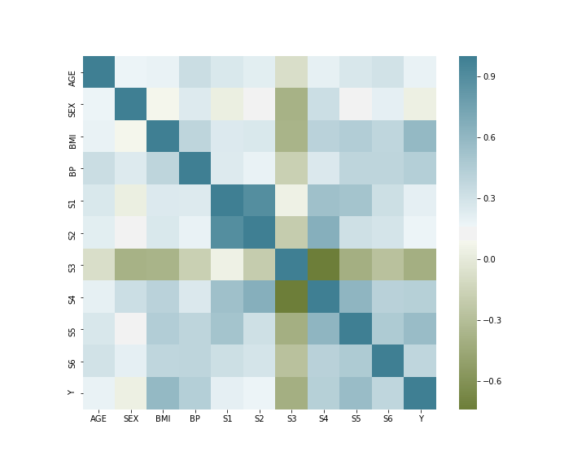
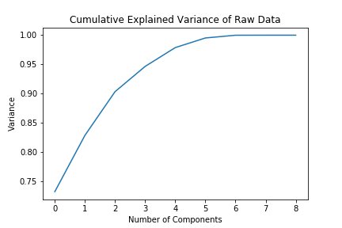
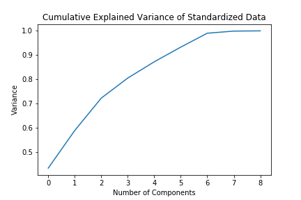
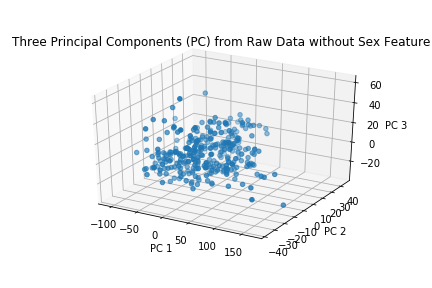

### CEBD 1160 Final Project

| Name | Date |
|:-------|:---------------|
|Marchiano Dong Jun Oh | March 29, 2019|

-----

### Resources
This final project repository has the following:

- Python script for the analysis: `final-project.py`
- Results figures in: `figures/`
- Dockerfile for the project: `Dockerfile`
- runtime-instructions in: `RUNME.md`

-----

### Research Question

What is the predicted progression of diabetes given age, sex, BMI, blood pressure, S1, S2, S3, S4, S5, and S6 data?

### Abstract

The diabetes dataset presents ten measured features to track the progression of diabetes for 442 subjects. The progression is presented as a feature named 'Y'. The task at hand was to be able to predict Y; the research question can thereby be answered by constructing a regression model using machine learning of the features in the diabetes dataset. Python data manipulation, data visualization, and machine learning libraries (e.g. numpy, pandas, matplotlib, seaborn, plotly, scikit-learn) were used to create the data model that would predict Y. A python script to construct the machine learning model from this dataset that would predict Y was made. Plots were made for exploratory purposes to visualize how the data were distributed and if any trends were apparent. Visualization was also used to determine which features are best to include in the model. Machine learning model creating functions in the scikit-learn library were used to create the Y predicting model. A extension of the purpose of this project was to construct the simplest prediction model as possible using the minimal number of data dimensions and hence linear regression and principal component analysis (PCA) were used. While the prediction models were constructed, their performances suggest that there is improvement to be had and that other regression techniques are likely better suited to make progression predictions from this dataset.

### Introduction

The diabetes dataset consists of ten baseline variables-age, sex, body mass index, average blood pressure, and six blood serum measurements- that were obtained for each of 442 diabetes patients and the response of interest, a quantitative measure of disease progression one year after baseline (Y) [1].

### Methods

Scatter plots were initially made to visualize how each feature related to Y. A hypothesis was that the features that appear visually to have a relationship with Y will be correlated with each other. These features in turn would be a good predictor of Y and thus should be included in a regression model. To visualize the correlation between features and ascertain which features are best to include in a regression model, a correlation matrix was made.

To build a valid regression model, all data needed to be on the same scale and thus the categorical feature of 'sex' was removed from the dataset. The technique of linear regression was chosen to model the data and predict Y as the goal of this project was to create the simplest prediction model possible. Principal component analysis (PCA) was also incorporated to reduce data dimensionality in hopes of simplifying the model. Models were made, trained, and tested for raw and standardized data and the principal components of these data. Once the models were made, their prediction ability were evaluated using the model score function within the scikit-learn Python library and root mean square error (RMSE) values.

### Results

From the correlation heat map, none of the features were strongly correlated with Y and reducing the number features to include in the linear regression model was difficult. PCA was used to reduce dataset dimensionality and aid in making the simplest prediction model possible. Reducing the dimensionality of the dataset was hypothesized to enable a simpler prediction model to be built. PCA was conducted to explain 90% of the variance in the original dataset. Thus, this process was believed to result in a simpler prediction model that would only sacrifice prediction ability to a slight degree. PCA results indicated three and six components were needed to explain 90% of the variance in the raw and standardized data respectively.

 

\
*An example to visualize principal components is shown below:*

Linear regression model results for the four types of data transformations are shown in the table below:

Model | Model Score | RMSE
--- | --- | ---
Raw | 0.3594 | 57.1664
Standardized | 0.3593 | 57.1667
PC Raw | 0.2766 | 60.7500
PC Standardized | 0.3649 | 56.9196

None of the models indicate a strong diabetes progression prediction ability from the features in the original dataset. Relatively low performance scores and high RMSE values indicate that these prediction models are weak despite the dataset transformations and dimensionality reduction. The linear regression models built from principal components were only marginally improved for the model built using standardized data and worse for raw data. These observations indicate that reducing the dimensionality of the dataset did not add much prediction ability.   

### Discussion

Model performance and RMSE scores indicate that the diabetes progression prediction models made for this project can be improved. Linear regression was likely not the best regression technique to use for this dataset. To improve prediction ability in the future, other regression techniques can be explored to construct models that would yield better prediction performance. Multiple techniques can be explored and their performances evaluated to determine which one performs best at predicting diabetes disease progression. Techniques such as K-nearest regression, gradient boost regression, polynomial regression, or other sophisticated methods may model the diabetes dataset better and improve the prediction of Y.

### References
[1]. Adapted from https://scikit-learn.org/stable/datasets/index.html#diabetes-dataset

-------
