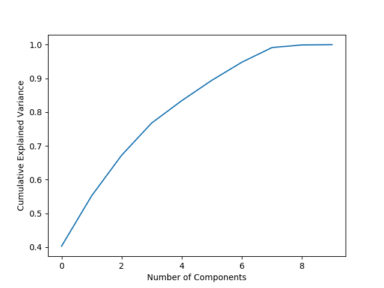

# cebd1160_project_template

| Name | Date |
|:-------|:---------------|
|Marchiano Dong Jun Oh | March 29, 2019|

-----

### Resources
This final project repository has the following:

- Python script for the analysis: `final-project.py`
- Results figures in: `figures/`
- Dockerfile for the experiment: `Dockerfile`
- runtime-instructions in a file: `RUNME.md`

-----

## Research Question

What is the predicted progression of diabetes given age, sex, BMI, blood pressure, S1, S2, S3, S4, S5, and S6 data?

### Abstract

The diabetes dataset presents ten measured features to track the progression of diabetes for 442 subjects. The progression is presented as a feature named 'Y'. The task at hand is to be able to predict Y and the research question can be answered by constructing a regression model using machine learning of the features in the dataset. Python data manipulation, data visualization, and machine learning libraries (e.g. numpy, pandas, matplotlib, seaborn, scikit-learn) will be used to create the data model that would predict Y. A python script to construct the machine learning model from this dataset that would predict Y was made. Plots were made for exploratory purposes to visualize how the data were distributed and if any trends were apparent. Visualization was also used to determine which features are best to include in the model. Machine learning model creating functions in the scikit-learn library were used to create the Y predicting model.

### Introduction

The diabetes dataset consists of ten baseline variables-age, sex, body mass index, average blood pressure, and six blood serum measurements- that were obtained for each of 442 diabetes patients and the response of interest, a quantitative measure of disease progression one year after baseline (Y) [1].

### Methods

Brief (no more than 1-2 paragraph) description about how you decided to approach solving it. Include:

- pseudocode for this method (either created by you or cited from somewhere else)
- why you chose this method

Scatter plots were initially made to visualize how each feature related to Y. A hypothesis was that the features that appear visually to have a relationship with Y will be correlated with each other. These features would be a good predictor of Y and thus should be included in a regression model. To visualize the correlation between features and ascertain which features are best to include in a regression model, a correlation matrix was made.
The use of principal component analysis (PCA) to reduce data dimensionality was explored in hopes of simplifying the regression model.

### Results

Brief (2 paragraph) description about your results. Include:

- At least 1 figure
- At least 1 "value" that summarizes either your data or the "performance" of your method
- A short explanation of both of the above

### Discussion
Brief (no more than 1-2 paragraph) description about what you did. Include:

- interpretation of whether your method "solved" the problem
Talk about model score and how it does the job but definitely can be better at predicting Y
score value, RMSE value suggest the point above

- suggested next step that could make it better.

In the future, other regression techniques such as K-nearest regression, gradient boost regression, or polynomial regression can be used to improve the performance of the prediction model. These techniques may model the diabetes dataset better and improve the prediction of Y.

### References
[1]. Adapted from https://scikit-learn.org/stable/datasets/index.html#diabetes-dataset

-------
